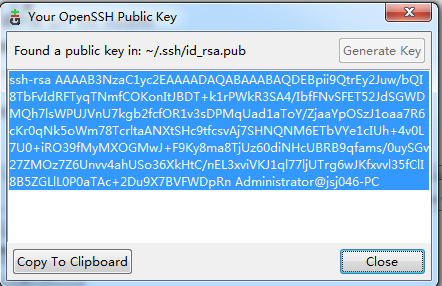

[TOC]

#git学习笔记

## 工具
- 客户端 git for windows 

##配置

>git config --global user.name "pcjk8866"  
git config --global user.email "pcjk8866@gmail.com"

- 假如说 客户端乱码了 可以设置 

	git config --global gui.encoding utf-8

- 如果客户端无法登陆，先将ssh-key上传到github上

##git window 下建立仓库

## git切换远程server
git remote add origin https://git.oschina.net/pcjk8866/VideoParseAndPerformancePlatform.git
git pull origin master