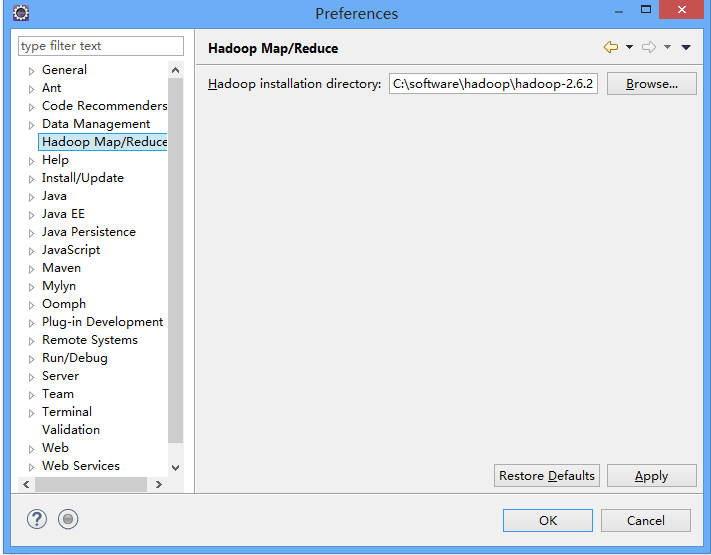
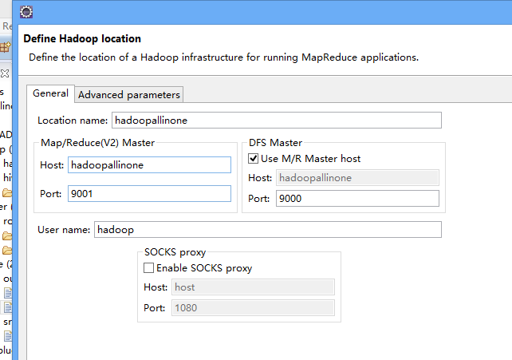

[TOC]

#hadoop的eclipse插件编译

##下载ant
##配置ant

##下载

https://github.com/winghc/hadoop2x-eclipse-plugin

## 编译

ant jar -Dhadoop.version=2.6.2 -Declipse.home=C:\software\eclipse -Dhadoop.home=C:\software\hadoop\hadoop-2.6.2

##错误

编译 卡到 inv-resolve-common

解决办法1  
	<target name="compile" depends="init, ivy-retrieve-common" unless="skip.contrib"> 

修改为
	 <target name="compile"  unless="skip.contrib">

##将插件放到eclipse目录下的plugin下
编译好的插件位置在build\contrib\eclipse-plugin下
##插件配置

