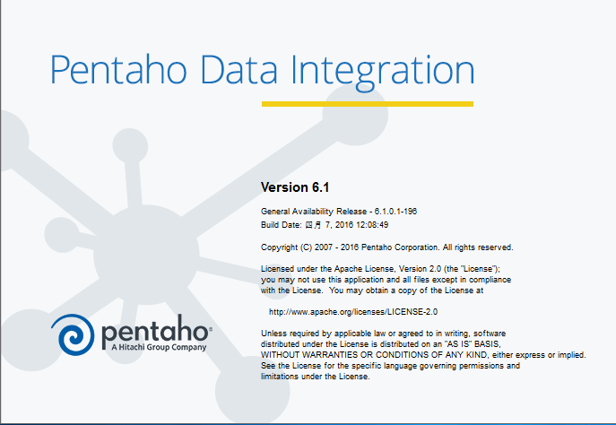
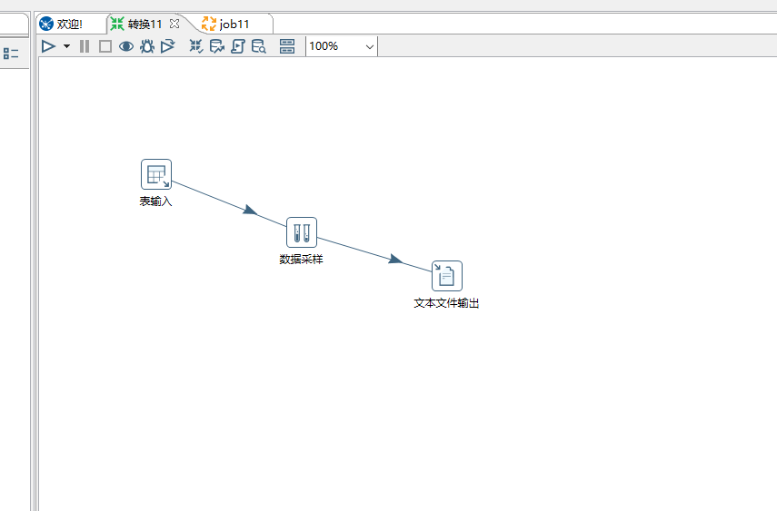
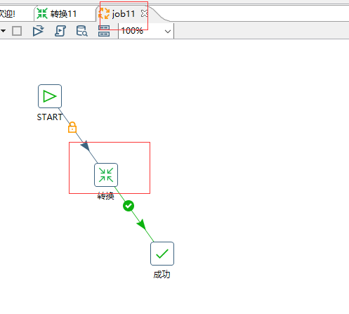

[TOC]

#kettle使用
#环境准备

- jdk1.7.051  

##下载kettle
从[kettle官网](http://community.pentaho.com/projects/data-integration/)下载
##解压kettle
解压文件pdi-ce-6.1.0.1-196.zip 到C盘即可直接使用
##使用kettle
启动界面

  

transforation
   

job
   