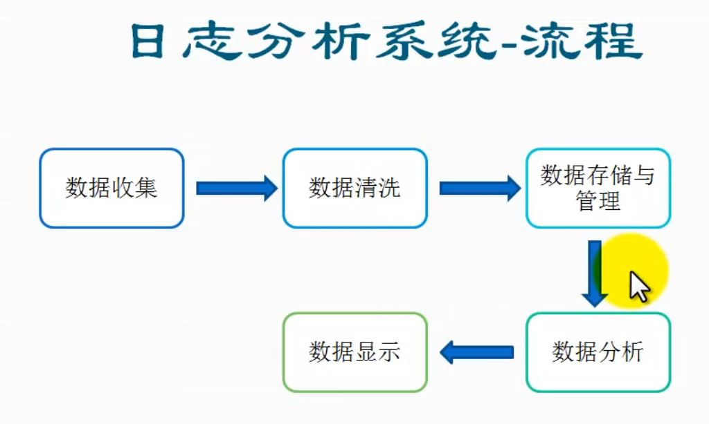
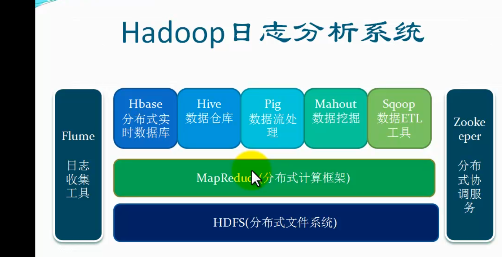
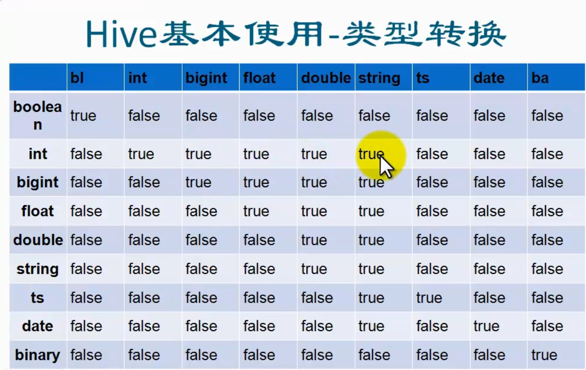

[TOC]

#hive学习笔记

##简介

系统流程

具体为：数据收集-->数据清洗-->数据存储与管理-->数据分析-->数据显示

hive架构

hive客户端访问方式

hwi方式访问hive  该种方式在正常的开发中是不经常使用的，因为比较麻烦
这种模式在最近的版本2.0以上的hive没有war包，需要从源码包中编译

##tips 
在当前终端生效

1. hive的cli终端启动时显示正在使用的数据库名 set hive.cli.print.current.db=true;  
2. 显示查询的列名 set hive.cli.print.header=true;  
3. 可以在hive-site.xml中设置
	
	<property>
		<name>hive.cli.print.current.db</name>
	</property>
	<property>
		<name>hive.cli.print.header</name>
		<value>true</value>
	</property>

##hive的开发环境配置  

###引入hadoopjar包  
###引入hivejar包  
###代码开发  
启动hiveserver 
	hive --service hiveservice2

	hiveserver2

beeline 使用
	
	beeline -n hadoop -u jdbc:hive2://hadoopallinone:10000/ip140

hive --service hiveserver2  
在hive的官网上有相关的java代码  
参见LanguageMaunal的BeeLine Cli中jdbc章节  

##数据类型

- 基本数据类型
	
	tinyint,smallint,int,bigint,boolean,float,double,string,binary,timestamp,decimal,char,varchar,date

- 集合数据类型

	array: 可以通过下标进行访问 array[1]  
	map：map['key']  
	struct: struct.key  

##hive基本类型转换

##hive的基本使用  文件

文件格式：textfile sequence rcfile  
扩展接口: 默认的文件读取方式  自定义inputformat 自定义serde

##hive创建表

[hive官网创建表](https://cwiki.apache.org/confluence/display/Hive/LanguageManual+DDL#LanguageManualDDL-Create/Drop/TruncateTable)  

	CREATE [TEMPORARY] [EXTERNAL] TABLE [IF NOT EXISTS] [db_name.]table_name    -- (Note: TEMPORARY available in Hive 0.14.0 and later)
	  [(col_name data_type [COMMENT col_comment], ...)]
	  [COMMENT table_comment]
	  [PARTITIONED BY (col_name data_type [COMMENT col_comment], ...)]
	  [CLUSTERED BY (col_name, col_name, ...) [SORTED BY (col_name [ASC|DESC], ...)] INTO num_buckets BUCKETS]
	  [SKEWED BY (col_name, col_name, ...)                  -- (Note: Available in Hive 0.10.0 and later)]
	     ON ((col_value, col_value, ...), (col_value, col_value, ...), ...)
	     [STORED AS DIRECTORIES]
	  [
	   [ROW FORMAT row_format] 
	   [STORED AS file_format]
	     | STORED BY 'storage.handler.class.name' [WITH SERDEPROPERTIES (...)]  -- (Note: Available in Hive 0.6.0 and later)
	  ]
	  [LOCATION hdfs_path]
	  [TBLPROPERTIES (property_name=property_value, ...)]   -- (Note: Available in Hive 0.6.0 and later)
	  [AS select_statement];   -- (Note: Available in Hive 0.5.0 and later; not supported for external tables)
	 
	CREATE [TEMPORARY] [EXTERNAL] TABLE [IF NOT EXISTS] [db_name.]table_name
	  LIKE existing_table_or_view_name
	  [LOCATION hdfs_path];
	 
	data_type
	  : primitive_type
	  | array_type
	  | map_type
	  | struct_type
	  | union_type  -- (Note: Available in Hive 0.7.0 and later)
	 
	primitive_type
	  : TINYINT
	  | SMALLINT
	  | INT
	  | BIGINT
	  | BOOLEAN
	  | FLOAT
	  | DOUBLE
	  | STRING
	  | BINARY      -- (Note: Available in Hive 0.8.0 and later)
	  | TIMESTAMP   -- (Note: Available in Hive 0.8.0 and later)
	  | DECIMAL     -- (Note: Available in Hive 0.11.0 and later)
	  | DECIMAL(precision, scale)  -- (Note: Available in Hive 0.13.0 and later)
	  | DATE        -- (Note: Available in Hive 0.12.0 and later)
	  | VARCHAR     -- (Note: Available in Hive 0.12.0 and later)
	  | CHAR        -- (Note: Available in Hive 0.13.0 and later)
	 
	array_type
	  : ARRAY < data_type >
	 
	map_type
	  : MAP < primitive_type, data_type >
	 
	struct_type
	  : STRUCT < col_name : data_type [COMMENT col_comment], ...>
	 
	union_type
	   : UNIONTYPE < data_type, data_type, ... >  -- (Note: Available in Hive 0.7.0 and later)
	 
	row_format
	  : DELIMITED [FIELDS TERMINATED BY char [ESCAPED BY char]] [COLLECTION ITEMS TERMINATED BY char]
	        [MAP KEYS TERMINATED BY char] [LINES TERMINATED BY char]
	        [NULL DEFINED AS char]   -- (Note: Available in Hive 0.13 and later)
	  | SERDE serde_name [WITH SERDEPROPERTIES (property_name=property_value, property_name=property_value, ...)]
	 
	file_format:
	  : SEQUENCEFILE
	  | TEXTFILE    -- (Default, depending on hive.default.fileformat configuration)
	  | RCFILE      -- (Note: Available in Hive 0.6.0 and later)
	  | ORC         -- (Note: Available in Hive 0.11.0 and later)
	  | PARQUET     -- (Note: Available in Hive 0.13.0 and later)
	  | AVRO        -- (Note: Available in Hive 0.14.0 and later)
	  | INPUTFORMAT input_format_classname OUTPUTFORMAT output_format_classname

## 其他表操作

- 显示所有表：show tables;  
- 显示表的描述信息 desc formatted talbename;  
- 显示建表语句：show create table tablename;  04.
- 删除表: dorp talbe tablename ;
- 由一个表创建另一个表 create table test3 like test2;
- 从其他表查询创建表  create table test4 as select name ,addr from test5;
- 分区表增加分区 alter table test_ep add partition(dt='');

##hive命令

	hive --help查看hive的用法
	hive -S -e "" > filename;不输出打印
	hive -f filename;使用文件
	使用脚本

##other命令
	
	hive
	list; 此命令简单些

	source /home/hadoop/app/filename

配置变量
	
	set val=""; ${hiveconf:val};

环境变量
	
	${env:HOME};select '${env:HIVE_HOME}' from test_ep ;

##hive数据加载  
###内表数据加载：  

- 创建表时加载： create table tablename as select * from oldtable  
- 创建表时指定数据位置：create table tablename location '';  
- 本地数据加载：load data localpath inpath 'localpath' [overwrite] into table tablename ;  
- 加载dfs数据: load data inpath 'hdfspath' [overwrite] into table tablename;  
- 使用hadoop命令拷贝数据到指定位置  hdfs dfs -copyFromLocal localpath hdfspath  
- insert  有两种语法 insert into table tablename select cols from oldtable ; 另外一种是hive专用的

###外表数据加载：  

- 创建表时指定位置  craete external table tablename location   
- 查询插入，同内表  
- 使用hadoop命令拷贝数据到指定位置  

###分区表：  

- 内部分区表和外部分区表类似，只不过加载数据时需要指定分区  

- 本地加载
- 加载hdfs数据
- 查询插入  

###hive数据加载注意问题

- 分隔符问题，且分隔符默认只有单个字符  
- 数据类型对应问题 1 load数据，字段类型不能相互转换时，查询为null 2select查询插入，字段类型不能互为转化是，插入数据为NULL  
- select 查询插入数据，字段顺序要与表中字段顺序一致，不可不一致  
- hive在数据加载时不做检查，查询时检查  
- 外部分区表需要添加分区才能看到数据

##数据导出及动态分区
###导出方式  

- hadoop命令的方式  
- 通过 insert... diectory方式
	insert overwrite [local] directory 'path' row format delimited fields terminated by '/t' select * from test;  
- shell hive -f/e | sed/grep/awk >file  
- 第三方工具 sqoop

### hive动态分区

几个参数：  

- set hvie.exec.dynamic.partition=true //使用动态分区  
- set hive.exec.dynamic.partition.mode=nostrick;// 无限制模式
- set hive.exec.max.dynamic.partitions.pernode=1000;//每个节点生成动态分区的最大个数 
- set hive.exec.max.dynamic.partions=1000 //生成对台分区的最大个数 最好不要查过1000个  否则 mysql 会出现一些链接问题   
- set hive.exec.max.created.files=1500；//一个任务最多可以创建的文件数目  
- set dfs.datanode.max.xcievers = 8192 //限定一次最多打开的文件数  

	insert overwrite table test_part partion(value,dt) select id,name,value,dt from test

##表属性的操作

- 修改表名 alter table tablename rename to new_table_name;  
- 修改列名 alter table tablename change column c1 c2 int comment 'xxxxx' after colx;  
-增加列 alter  table tablename add colunms (c1 string comment 'xxxx',c2 long comment 'yyyy')  
- desc formatted tablename   
- 修改tblproperties alter table tablename set tblproperties (property_name=property_value,property_name=property_value,...)  
-- alter table tablename partition(dt='xxx') set serdeproperties('field.delim'='\t');  
- 修改location  alter tablename set location='hdfs://host:port/path'  
- 内表 外表  alter table city set tblproperties('EXTERNAL'='TRUE');  
- wiki LanguageManualDDL

##Hive高级查询
- 查询操作 group by ,order by ,join ,distribute by , sort by , cluster by ,union all  
-count 计数 count(*) count(1) count(col)  
- sum 求和 sum(可转成数字的值)返回bigint sum(col)+cast(1 as bigint)   
- avg 求平均值 avg(可转成数字的值)
- distinct 不同值个数 count(distinct col)

###order by 

	select col1 from table where condition order by col1,col2 [asc|desc]

注意： order by 1后面可以有多个列进行白须，默认按照字典排序  
2order by   为全局排序  
3 order by 需要reduce操作，且只有一个reduce，与配置无关，如果内存不足，可能会内存溢出   

###group by
按照某些字段的值进行分组，有相同值放在一起

	select col1,col2,count(1),sum(col1) from table where condition group by col1[,col2] having ...  

注意： 

- select后面非聚合列必须出现在group by 中  
- 除了普通列就是一些聚合操作  
- group by 后面也可以跟表达式，比如 苏北str(col)  

特性  

- 使用了reduce操作，受限于reduce数量，设置reduce参数 mapred.reduce.tasks  
- 输出文件个数与reduce数相同，文件大小与reduce处理的数据量有关  

问题  

- 网络负载过重  
- 数据倾斜，优化参数 hive.groupby.skewindata  

### join
表连接

- 两个表m，n之间按照on 条件连接 ，m中的一条记录和n中的一条记录组成一条新的纪录  
- join 等值连接，只有某个值在m和n中同时存在  
- left outer join 做外联接，坐标中的值无论是否在b中存在时，都输出，右表中的值只有在左表中存在时才会输出  
- right outer join 和left out join 相反  
- left semi join 类似 exists  
- mapjoin 在map段完成join操作，不需要reduce，基于内存做join 属于优化操作

##mapjoin 
自动

- set hive.auto.convert.join = true;  
- hive.mapjoin.smalltable.filesize默认值是25mb

手工指定

- select /*+mapjoin(n)*/ m.col from m join n on m.col = n.col  

mapjoin使用场景

- 关联表中有一个表非常小  
- 不等之的连接操作  

###distribute by 和sort by

	select col1,col2 from m distribute by col1 sort by col1 asc, col2 desc;

两者结合出现，确保每个reduce的输出都是有序的

###cluster by
cluster by = distibute by col order by col

##hive函数基本分类和介绍
函数  
内置函数  简单函数  聚合函数 集合函数 特殊函数
自定义函数  UDF UDAF
  
###简单函数

 关系运算  数学运算 逻辑运算  数值计算 类型转换 日期函数 条件函数 字符串函数 统计函数

###聚合函数
sum() count() avg() distinct() min() max()

###集合函数
复合类型构建 复杂类型访问 复杂类型长度

###特殊函数
窗口函数  分析函数 混合函数 UDTF  
窗口函数：用于分区排序 动态group by  topn 累计计算 层次计算  
windowing functions 
lead lag first_value last_value  
分析函数：the over clause  [count sum min max avg ] analytics functions rank row_number dense_rank cume_dist percent_rank ntile  
混合函数:  
java_method(class,method[,arg1[,arg2]])  
reflect(class,method[,arg1[,arg2]])  
hash(class,method[,arg1[,arg2]])  
UDTF:  
表函数 lateral view   explode

first_value(salary) over (partition by id order by salary  rows between 1 preceding and 1 following ) first_value  
rank() over( order by salary desc ) as rank  
DENSE_RANK() over (order by salary desc) AS dense_rank    
ntile(5) over (partition by id order by salary desc) ntile  
percent_rank() over (partition by id order by salary desc) pr  
cume_dist() over (partition by id order by salary desc) cd   
java_method("java.lang.Math","sqrt",cast(id as double)) idsqrt  
select id,adid from test_salary lateral view explode(split(salary,'0')) tt as adid;  
select 1 from test_salary where 'footbar' rlike '^f.*r$';

##自定义函数
UDF 单条  
定义一个java类  
集成UDF  
重写evaluate方法  
打jar包  
hive执行addjar 
add jar /opt/jars/TestUDF.jar;   
hive执行创建模板  
create temporary function bigthan as 'udf.TestUDF';  
使用hsql  

UDAF 聚合  
永久函数:  
将初始化语句放在文件里面  
新建 ~/.hiverc  将初始化语句放在该文件中  