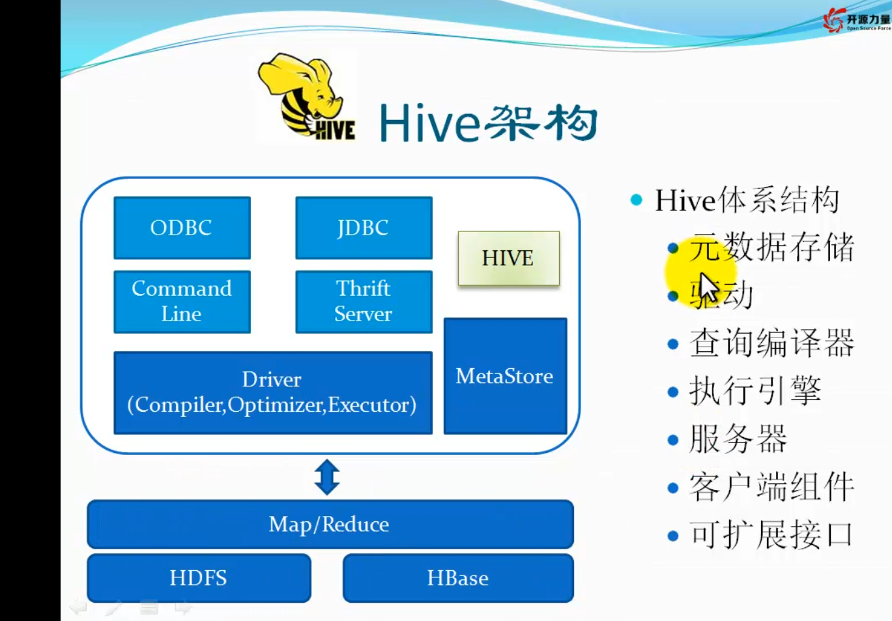

[TOC]

#hive学习笔记

##简介

系统流程

具体为：数据收集-->数据清洗-->数据存储与管理-->数据分析-->数据显示

hive架构

hive客户端访问方式

hwi方式访问hive  该种方式在正常的开发中是不经常使用的，因为比较麻烦
这种模式在最近的版本2.0以上的hive没有war包，需要从源码包中编译

##tips 
在当前终端生效

1. hive的cli终端启动时显示正在使用的数据库名 set hive.cli.print.current.db=true;  
2. 显示查询的列名 set hive.cli.print.header=true;  
3. 可以在hive-site.xml中设置
	
	<property>
		<name>hive.cli.print.current.db</name>
		<value>true</value>
	</property>
	<property>
		<name>hive.cli.print.header</name>
		<value>true</value>
	</property>

##hive的开发环境配置  

###引入hadoopjar包  
###引入hivejar包  
###代码开发  
启动hiveserver 
	hive --service hiveservice2

	hiveserver2

beeline 使用
	
	beeline -m hadoop -u jdbc:hive2://hadoopallinone:10000/ip140

hive --service hiveserver2  
在hive的官网上有相关的java代码  
参见LanguageMaunal的BeeLine Cli中jdbc章节  

##数据类型

- 基本数据类型
	
	tinyint,smallint,int,bigint,boolean,float,double,string,binary,timestamp,decimal,char,varchar,date

- 集合数据类型

	array: 可以通过下标进行访问 array[1]  
	map：map['key']  
	struct: struct.key  

##hive基本类型转换

##hive的基本使用  文件

文件格式：textfile sequence rcfile  
扩展接口: 默认的文件读取方式  自定义inputformat 自定义serde

##hive创建表

[hive官网创建表](https://cwiki.apache.org/confluence/display/Hive/LanguageManual+DDL#LanguageManualDDL-Create/Drop/TruncateTable)  

	CREATE [TEMPORARY] [EXTERNAL] TABLE [IF NOT EXISTS] [db_name.]table_name    -- (Note: TEMPORARY available in Hive 0.14.0 and later)
	  [(col_name data_type [COMMENT col_comment], ...)]
	  [COMMENT table_comment]
	  [PARTITIONED BY (col_name data_type [COMMENT col_comment], ...)]
	  [CLUSTERED BY (col_name, col_name, ...) [SORTED BY (col_name [ASC|DESC], ...)] INTO num_buckets BUCKETS]
	  [SKEWED BY (col_name, col_name, ...)                  -- (Note: Available in Hive 0.10.0 and later)]
	     ON ((col_value, col_value, ...), (col_value, col_value, ...), ...)
	     [STORED AS DIRECTORIES]
	  [
	   [ROW FORMAT row_format] 
	   [STORED AS file_format]
	     | STORED BY 'storage.handler.class.name' [WITH SERDEPROPERTIES (...)]  -- (Note: Available in Hive 0.6.0 and later)
	  ]
	  [LOCATION hdfs_path]
	  [TBLPROPERTIES (property_name=property_value, ...)]   -- (Note: Available in Hive 0.6.0 and later)
	  [AS select_statement];   -- (Note: Available in Hive 0.5.0 and later; not supported for external tables)
	 
	CREATE [TEMPORARY] [EXTERNAL] TABLE [IF NOT EXISTS] [db_name.]table_name
	  LIKE existing_table_or_view_name
	  [LOCATION hdfs_path];
	 
	data_type
	  : primitive_type
	  | array_type
	  | map_type
	  | struct_type
	  | union_type  -- (Note: Available in Hive 0.7.0 and later)
	 
	primitive_type
	  : TINYINT
	  | SMALLINT
	  | INT
	  | BIGINT
	  | BOOLEAN
	  | FLOAT
	  | DOUBLE
	  | STRING
	  | BINARY      -- (Note: Available in Hive 0.8.0 and later)
	  | TIMESTAMP   -- (Note: Available in Hive 0.8.0 and later)
	  | DECIMAL     -- (Note: Available in Hive 0.11.0 and later)
	  | DECIMAL(precision, scale)  -- (Note: Available in Hive 0.13.0 and later)
	  | DATE        -- (Note: Available in Hive 0.12.0 and later)
	  | VARCHAR     -- (Note: Available in Hive 0.12.0 and later)
	  | CHAR        -- (Note: Available in Hive 0.13.0 and later)
	 
	array_type
	  : ARRAY < data_type >
	 
	map_type
	  : MAP < primitive_type, data_type >
	 
	struct_type
	  : STRUCT < col_name : data_type [COMMENT col_comment], ...>
	 
	union_type
	   : UNIONTYPE < data_type, data_type, ... >  -- (Note: Available in Hive 0.7.0 and later)
	 
	row_format
	  : DELIMITED [FIELDS TERMINATED BY char [ESCAPED BY char]] [COLLECTION ITEMS TERMINATED BY char]
	        [MAP KEYS TERMINATED BY char] [LINES TERMINATED BY char]
	        [NULL DEFINED AS char]   -- (Note: Available in Hive 0.13 and later)
	  | SERDE serde_name [WITH SERDEPROPERTIES (property_name=property_value, property_name=property_value, ...)]
	 
	file_format:
	  : SEQUENCEFILE
	  | TEXTFILE    -- (Default, depending on hive.default.fileformat configuration)
	  | RCFILE      -- (Note: Available in Hive 0.6.0 and later)
	  | ORC         -- (Note: Available in Hive 0.11.0 and later)
	  | PARQUET     -- (Note: Available in Hive 0.13.0 and later)
	  | AVRO        -- (Note: Available in Hive 0.14.0 and later)
	  | INPUTFORMAT input_format_classname OUTPUTFORMAT output_format_classname

## 其他表操作

- 显示所有表：show tables;  
- 显示表的描述信息 desc formatted talbename;  
- 显示建表语句：show create table tablename;  04.
- 删除表: dorp talbe tablename ;
- 由一个表创建另一个表 create table test3 like test2;
- 从其他表查询创建表  create table test4 as select name ,addr from test5;
- 分区表增加分区 alter table test_ep add partition(dt='');

##hive命令

	hive --help查看hive的用法
	hive -S -e "" > filename;不输出打印
	hive -f filename;使用文件
	使用脚本

##other命令
	
	hive
	list; 此命令简单些

	source /home/hadoop/app/filename

配置变量
	
	set val=""; ${hiveconf:val};

环境变量
	
	${env:HOME};select '${env:HIVE_HOME}' from test_ep ;

##hive数据加载  
内表数据加载：  

- 创建表时加载： create table tablename as select * from oldtable  
- 创建表时指定数据位置：create table tablename location '';  
- 本地数据加载：load data localpath inpath 'localpath' [overwrite] into table tablename ;  
- 加载dfs数据: load data inpath 'hdfspath' [overwrite] into table tablename;  
- 使用hadoop命令拷贝数据到指定位置  hdfs dfs -copyFromLocal localpath hdfspath  
- insert  有两种语法 insert into table tablename select cols from oldtable ; 另外一种是hive专用的

