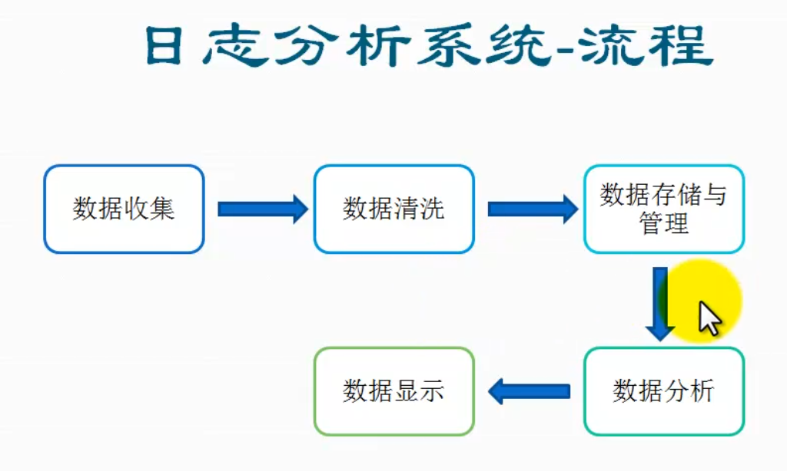

[TOC]

#hive项目扩展-日志分析系统

##简介

日志分析系统流程

具体为：数据收集-->数据清洗-->数据存储与管理-->数据分析-->数据显示

hive架构

hive客户端访问方式

hwi方式访问hive  该种方式在正常的开发中是不经常使用的，因为比较麻烦
这种模式在最近的版本2.0以上的hive没有war包，需要从源码包中编译

##tips 
在当前终端生效

1. hive的cli终端启动时显示正在使用的数据库名 set hive.cli.print.current.db=true;
2. 显示查询的列名 set hive.cli.print.header=true;

