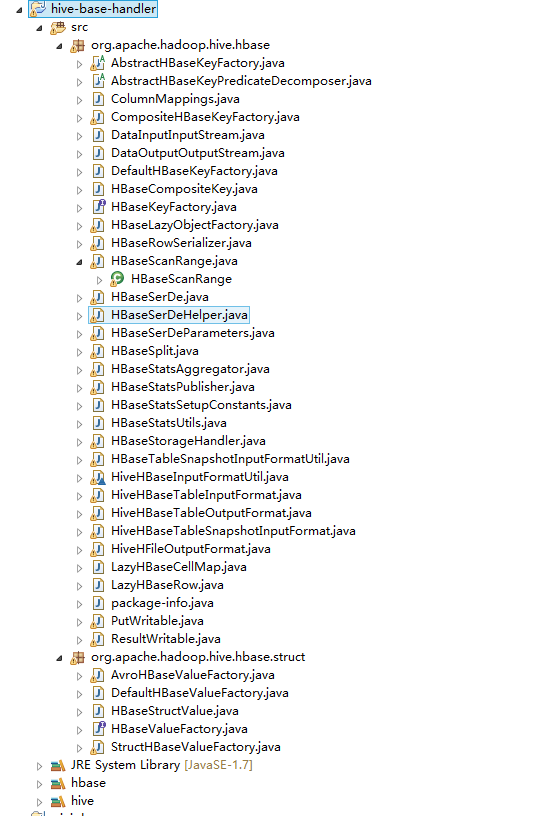

[TOC]

#hive和hbase整合

##官方原文

[官方原文](https://cwiki.apache.org/confluence/display/Hive/HBaseIntegration)

##环境说明

- hadoop2.6.2  
- hive1.2.1  
- hbase1.1.3

##hive安装
[hive安装](01.hive安装.md)
##hbase安装
[hbase安装](../04.hbase/01.hive伪分布式安装.md)

##hive和hbase整合
###拷贝jar

##验证
###hbase中创建表

	create 'user:hivetest',{NAME => 'f1',VERSIONS => 1},{NAME => 'f2',VERSIONS => 1},{NAME => 'f3',VERSIONS => 1}

向hvietest表中插入数据
	
	put 'user:hivetest','row1','f1:c1','name1'
	put 'user:hivetest','row1','f1:c2','name2'
	put 'user:hivetest','row1','f2:c1','age1'
	put 'user:hivetest','row1','f2:c2','age2'
	put 'user:hivetest','row1','f3:c1','job1'
	put 'user:hivetest','row1','f3:c2','job2'
	put 'user:hivetest','row1','f3:c3','job3'

查看数据

	scan 'user:hivetest'

###hive中创建表
启动hive   

	hive -hiveconf hbase.zookeeper.quorum=hadoopallinone
	ADD jar ${env:HIVE_HOME}/lib/hive-hbase-handler-1.2.1.jar（可以不需要设置）
	create database ip140_hivetest;
	use ip140_hivetest;
	CREATE EXTERNAL TABLE hivetest (
	rowkey string,
	f1 map<STRING,STRING>,
	f2 map<STRING,STRING>,
	f3 map<STRING,STRING>
	) STORED BY 'org.apache.hadoop.hive.hbase.HBaseStorageHandler'
	WITH SERDEPROPERTIES ("hbase.columns.mapping" = ":key,f1:,f2:,f3:")
	TBLPROPERTIES ("hbase.table.name" = "user:hivetest");
###查询表中数据
	
	select * from hivetest;

###插入数据
	
	insert  overwrite table hivetest select * from hivetest;

##错误汇总
##java.lang.NoSuchMethodError: org.apache.hadoop.hbase.client.Put.setDurability
拷贝hbase-client jar包 无效  
重新编译hive-hbase-handler-1.2.1.jar  
将源码导入eclipse中
  
export 导出后替换hive上的jar包即可  
[编译jar](01.dir/hive-hbase-handler/)